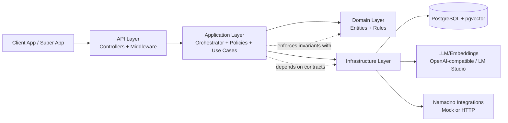
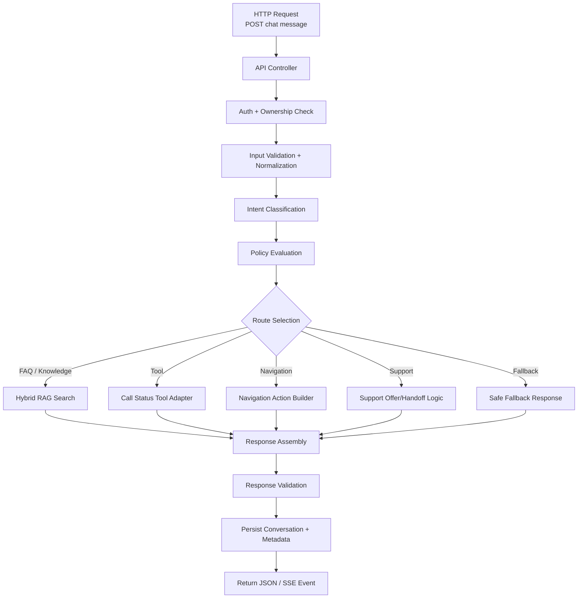
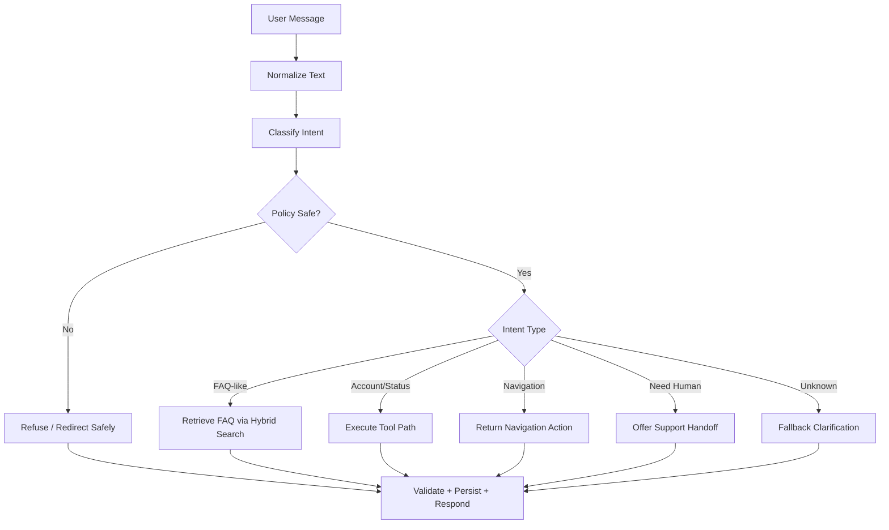
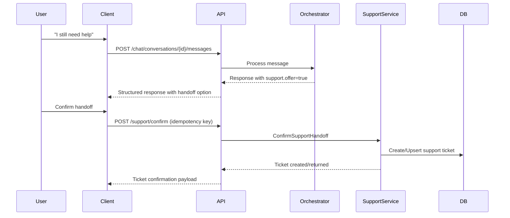

# Namadno AI Support Chatbot - Project Presentation

## 1) Executive Overview

Namadno AI Support Chatbot is a backend service that provides intelligent in-app support for users of the Namadno ecosystem. It is designed as an API-first microservice that receives user messages, understands intent, applies policy and safety checks, retrieves trusted FAQ knowledge, optionally calls business tools (for status checks), and returns structured assistant responses.

This repository contains **no frontend UI**. It exposes HTTP/SSE endpoints for:
- user conversations,
- support handoff and ticket confirmation,
- admin FAQ and support operations,
- analytics and operational health.

The project is designed to balance:
- fast user help for common questions,
- safe boundaries for sensitive requests,
- clear escalation to human support when needed.

---

## 2) Problem Statement and Value

### The problem
Support in financial/super-app contexts is difficult because:
- users ask in natural Persian language with mixed intent,
- many questions are repetitive but must remain accurate,
- some requests require account/tool data,
- risky domains require strict response constraints and escalation.

### What this system solves
- Centralized support orchestration for FAQ, navigation, tool answers, and support handoff.
- Policy-first safeguards against unsafe or out-of-scope responses.
- Structured response contract for client apps (text, actions, support metadata, intent/mode).
- Admin capabilities to manage FAQ and monitor unanswered questions.

### Business impact
- Reduces repetitive human support load.
- Improves user response time.
- Preserves safety and compliance posture through guardrails and escalation.
- Creates measurable support funnel metrics (chat -> unresolved -> ticket).

---

## 3) Scope and Boundaries

### In scope
- Conversation lifecycle API.
- Intent classification and orchestration.
- FAQ retrieval with hybrid ranking.
- Tool-based status checks (mock or HTTP integrations).
- Human handoff and ticket creation workflow.
- Admin endpoints for support operations.

### Out of scope
- Frontend/mobile UI.
- Financial execution or recommendations.
- Ownership of upstream user directory/auth provider.
- Final production corpus curation (seed FAQ is placeholder-level).

---

## 4) Technical Stack

### Core platform
- **Language/Runtime:** C# on .NET 10
- **Web framework:** ASP.NET Core Web API
- **Validation:** FluentValidation
- **Logging/Observability:** Serilog + built-in health checks
- **Rate limiting:** ASP.NET built-in rate limiter

### Data and storage
- **Database:** PostgreSQL
- **ORM:** Entity Framework Core + Npgsql
- **Vector support:** pgvector (for semantic FAQ retrieval)

### AI and retrieval
- **LLM interface:** OpenAI-compatible chat API (LM Studio-friendly)
- **Embedding interface:** OpenAI-compatible embeddings API
- **Fallback embedding:** deterministic hash embedding fallback
- **Retrieval strategy:** hybrid lexical + semantic scoring

### Operations
- **Containerization:** Docker (multi-stage)
- **Local orchestration:** Docker Compose (API + Postgres)
- **Test stack:** xUnit + architecture/evaluation test projects
- **API exploration:** Postman collection in `docs/postman`

---

## 5) Architecture

The codebase follows a **Clean Architecture** style with clear dependency direction:

1. **Domain**  
   Entities, enums, and business invariants.

2. **Application**  
   Use cases, orchestration, policies, interfaces, contracts, and business services.

3. **Infrastructure**  
   Persistence, external integrations, LLM adapters, vector search, background jobs.

4. **API**  
   Controllers, middleware, authentication wiring, composition root.

### Why this architecture
- Keeps business rules independent of frameworks.
- Improves testability by isolating infrastructure concerns.
- Enables integration mode switching (mock -> HTTP) without rewriting core logic.

### Trade-off
- More abstraction and files than a monolithic service.
- Requires disciplined conventions across layers.

### Architecture Diagram

---

## 6) Repository Walkthrough

## `src/Namadno.AI.Support.Api`
- Entry point and service wiring (`Program.cs`)
- Controllers for user/admin/support flows
- Middleware (global exception handling, auth-related handling)

## `src/Namadno.AI.Support.Application`
- Chat orchestration and routing logic
- Intent classification, policy evaluation, response shaping
- Admin services, contracts, and interfaces
- Configuration option contracts

## `src/Namadno.AI.Support.Domain`
- Core entities:
  - `Conversation`
  - `ConversationMessage`
  - `FaqArticle`
  - `SupportTicket`
  - related enums/value rules

## `src/Namadno.AI.Support.Infrastructure`
- EF Core DbContext and mappings
- Repositories and unit of work implementation
- pgvector search repository
- LLM/embedding client adapters
- Namadno mock/HTTP integration adapters
- In-process background job dispatcher

## `tests`
- Unit tests (domain/policy/parsers/config)
- Architecture tests (layer boundaries)
- Evaluation tests (dataset and intent quality gates)
- Integration test project (currently minimal placeholder)

## Content and prompts
- `copy/`: texts, lexicon, FAQ seed data
- `prompts/`: system prompts for chat behavior

---

## 7) End-to-End Request Flow

When a user sends a message:

1. API receives `POST /chat/conversations/{id}/messages`.
2. Conversation ownership and request validity are checked.
3. Message text is normalized and intent is classified.
4. Policy evaluator checks safety and domain constraints.
5. Orchestrator selects route:
   - FAQ/RAG answer,
   - tool-based answer,
   - navigation guidance,
   - support suggestion/handoff,
   - or safe fallback.
6. Assistant response is validated and enriched with metadata:
   - mode,
   - intent,
   - actions,
   - support availability/offer info.
7. Conversation/message data is persisted.
8. Client receives structured response JSON (or SSE event via stream endpoint).

### Request Handling Pipeline Diagram

### Orchestration Decision Diagram

### Support Handoff Sequence Diagram

---

## 8) API Surface (High-Level)

### User-facing
- Create/list/get conversation
- Send message to conversation
- Fetch conversation history
- Stream response event (SSE endpoint)

### Support workflow
- Confirm support handoff endpoint
- Idempotency key support for repeated confirms

### Admin
- FAQ CRUD and status management
- Support inbox listing, assignment, status updates, replies
- Unanswered question backlog
- Support analytics endpoints

### Operations
- Health endpoints:
  - `/health`
  - `/health/live`
  - `/health/ready`

Reference specification exists in `docs/api.md` and the Postman collection.

---

## 9) Data Model and Persistence

Main persisted aggregates/tables include:
- conversations
- conversation_messages
- faq_articles
- faq_embeddings
- support_tickets
- support_ticket_events
- unanswered_questions
- audit_events
- idempotency_records

### Important persistence characteristics
- EF Core configurations define keys, indexes, and constraints.
- Concurrency tokens (`xmin`) are used on key entities.
- Vector index strategy (HNSW/cosine ops) supports semantic retrieval performance.

---

## 10) AI, RAG, and Response Quality

### AI integration approach
- Uses OpenAI-compatible interfaces so it can target LM Studio or equivalent providers.
- Embedding and chat models are configurable.
- A fallback embedding model exists for resilience.

### Retrieval strategy
- Hybrid ranking combines lexical relevance and vector similarity.
- Keeps performance deterministic while preserving semantic flexibility.

### Quality controls
- Policy-first gating before generation.
- Response validation after generation.
- Prompt-injection and unsafe domain checks in policy path.

---

## 11) Security and Guardrails

### Authentication modes
- Development
- JWT
- Gateway
- TrustedHeaders

JWT middleware is conditionally activated based on strategy, while non-JWT modes rely on request-user context middleware patterns.

### Authorization and permissions
- Application services enforce permissions for admin/support operations.

### Runtime safeguards
- Route allowlists for navigation actions.
- Tool risk gating.
- Global exception handling with stable error codes.
- Request size and rate limits.
- Correlation ID propagation for tracing.

---

## 12) External Integrations

### Namadno adapters
- **Mock mode:** local deterministic behavior for development/testing.
- **HTTP mode:** configurable GET-based calls to external endpoints.

### Current integration maturity
- Contracts are config-driven.
- Endpoint paths are still placeholders and require finalization with upstream teams.

---

## 13) Setup, Run, and Deployment

### Local development options
1. `docker compose up --build`
2. `dotnet run --project src/Namadno.AI.Support.Api`

### Test execution
- `dotnet test Namadno.AI.Support.sln`

### Deployment characteristics
- Multi-stage Docker build.
- Non-root final runtime user.
- Healthcheck included.

### Operational note
- `.env.example` currently drifts from `appsettings.json` for model/dimension defaults and should be synchronized before production rollout.

---

## 14) Testing Strategy

### What is covered well
- Domain rules and invariants.
- Policy/normalization/classification behavior.
- Architecture dependency constraints.
- Evaluation dataset guardrails and intent checks.

### Current gap
- Integration tests are mostly placeholder and should be expanded to validate:
  - auth mode behavior,
  - ownership/authorization boundaries,
  - tool failure and retry behavior,
  - support handoff idempotency under concurrent requests.

---

## 15) Observability and Operability

Current signals:
- Structured Serilog logging.
- Health probes (liveness/readiness).
- Telemetry hooks in orchestration path.

Recommended KPI set:
- response latency by route (FAQ/tool/support),
- fallback rate,
- unanswered question rate,
- support handoff offer rate vs confirm conversion,
- auth/permission rejection rates.

---

## 16) Strengths, Risks, and Trade-offs

### Strengths
- Clear layered architecture with enforceable boundaries.
- Practical support-focused orchestration design.
- Hybrid retrieval and structured response contract.
- Explicit support handoff confirmation and idempotency handling.

### Key risks
- Placeholder FAQ/integration content not production-ready.
- Config drift across env examples vs runtime defaults.
- In-process background jobs are not durable/distributed.
- Limited real integration test depth.

### Trade-off summary
- Strong maintainability and safety over short-term simplicity.
- Flexible integration points with current dependency on upstream contract completion.

---

## 17) Roadmap Proposal

### Phase 1 - Production readiness
- Finalize real Namadno endpoint contracts.
- Replace seed FAQ with approved legal/product corpus.
- Align all environment/config defaults and docs.
- Add robust integration tests for critical paths.

### Phase 2 - Reliability and scale
- Introduce durable queue/background worker for critical jobs.
- Expand resilience patterns for external calls (timeouts/retries/circuit controls).
- Add richer metrics dashboards and alerting thresholds.

### Phase 3 - Experience improvements
- Improve SSE from single payload to token/chunk streaming UX.
- Add admin workflows for fast unanswered-to-FAQ curation.
- Tune RAG scoring weights with evaluation-driven iterations.

---

## 18) Suggested Live Demo Script (6 Minutes)

### Minute 0-1: Context and architecture
- Explain the support problem and why policy-first AI orchestration is needed.
- Show 4-layer architecture and clean boundaries.

### Minute 1-2: Service startup and health
- Start with Docker Compose.
- Hit `/health/live` and `/health/ready`.

### Minute 2-3: Basic support question
- Create conversation.
- Send FAQ-like user message.
- Show structured response fields (`mode`, `intent`, `actions`, `support`).

### Minute 3-4: Tool-assisted request
- Ask status-type question that triggers tool route.
- Mention mock vs HTTP adapter modes.

### Minute 4-5: Human handoff
- Trigger support suggestion and confirm handoff endpoint.
- Show ticket confirmation and idempotency behavior.

### Minute 5-6: Admin lens and roadmap
- Show unanswered/ticket/FAQ admin endpoints.
- Close with risks and readiness roadmap.

---

## 19) Presentation Talking Points (For Stakeholders)

- **For Product:** faster first response and reduced repetitive support cost.
- **For Engineering:** maintainable layered architecture with clear contracts.
- **For Compliance/Risk:** policy gating and explicit boundaries on unsafe domains.
- **For Operations:** health endpoints, logs, and measurable support funnel.
- **For Leadership:** clear path from MVP-safe backend to production-grade support platform.

---

## 20) Quick Q&A Prep

### "Can this run without external LLM cloud?"
Yes. It supports OpenAI-compatible local model endpoints (for example LM Studio-compatible setups).

### "How do we prevent risky advice?"
Policy-first checks, domain constraints, response validation, and escalation pathways.

### "How hard is integration with client apps?"
Low to moderate. APIs are REST/SSE with documented contracts and Postman collection.

### "What blocks immediate production?"
Final external endpoint contracts, approved FAQ corpus, stronger integration tests, and config hardening.

---

## 21) One-Slide Summary

Namadno AI Support Chatbot is a clean-architecture, policy-first backend support service that combines FAQ retrieval, safe conversational AI, tool-assisted status answers, and human handoff in a single API platform. It is technically strong for MVP and pilot deployments, with a clear roadmap to production through integration finalization, corpus hardening, and reliability test expansion.

